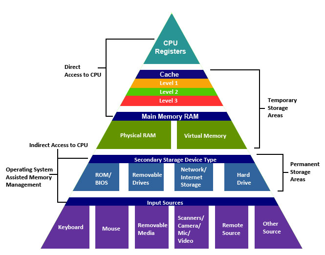
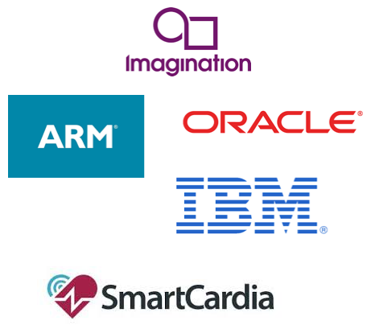
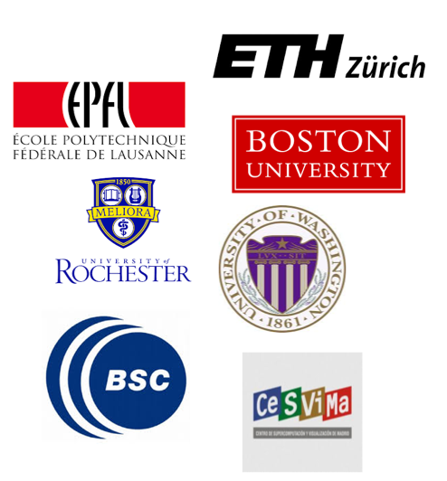

---
author:
- "Contact Info: Manuel Prieto (mpmatias@ucm.es), Katzalín Olcoz (katzalin@ucm.es), Luis Piñuel (lpinuel@ucm.es)"
date: June 27th 2023
title: ArTeCS Research Group
---

## Presentation

### ArTeCS Research Group

``{=html}

-   **ArTeCS: aka Architecture & Technology of Computing Systems**
    -   Department of Computer Architecture and Systems Engineering
    -   Complutense University of Madrid

``{=html}

-   **People**
    -   21 Faculty Members
    -   10 PhD and Master Students
-   **"Excellent Group"**
    -   Graded as "Excellent" by an UCM evaluation commissioned by the
        State Research Agency.

## Research

### High Performance Computing

We have been developing software for emerging high-performance computer
systems since the mid 90's

-   **Optimization and system software for "new"
    (heterogeneous/asymmetric) architectures**
    -   Libraries, compilers and tool for code generation
    -   Run-time Systems
    -   OS Kernel / Hypervisor

``{=html}

-   **Application mapping (data/compute intensive applications)**
    -   Bioinformatics
    -   Image/Video Processing (Motion estimation, Face Recognition,
        ...)
    -   Computational Fluid Dynamics (Lattice Boltzmann)
    -   Hyperspectral Imaging (Target Detection)
    -   ...

### Computer Architecture

We have been architecting high-performance microprocessors and computer
systems with a focus on:

-   **Processor Microarchitecture (HPC and Embedded Systems)**
    -   Non-standard arithmetic units (Posit)
	-   Post-Quantum Cryptography units
    -   RISC-V: SoC design and ISA extensions

``{=html}

-   **Memory Hierarchy (HPC and Embedded Systems)**
    -   Non-Volatile Memories
    -   Caches
-   **Thermal-aware Design**
    -   Thermal Modeling & Management of Heterogeneous Datacenter
        Configurations
    -   Advanced Cooling Techniques

### Embedded Systems Design

We have been implementing tools and systems for embedded devices

``{=html}

-   **Design Automation**
    - High Level Synthesis
-   **Wireless Body Sensors**
    - Energy Management & Harvesting
-   **Biomedical engineering**
    - Non-invasive Ambulatory Monitorization
-   **IoT**
    - Low-Earth Orbit (LEO) satellite communications
-   **Edge-AI**
	- Low power Neural Network accelerators 
<!-- -   Cyanobacteria Blooms detection -->

### Current Research Projects

-   **EFFICIENT:** System Software for Next-Generation Architectures and
    Applications
    -   MCIN/AEI PID2021
-   **ASIMOV:** Architecture Specialization from arIthmetical and MemOry
    perspectiVes
    -   MCIN/AEI PID2021
-   **SMART-BLOOMS:** Beyond the use of Digital Technologies in
    Cyanobacteria Blooms: Smart Management of Cyanobacteria exploiting
    Digital Twins and Edge Computing
    -   MCIN/AEI TED2021

## Technology transfer & Collaborations

### Industrial Contracts

``{=html}

-   **What we have done?**
    -   Application mapping, parallelization & optimization
    -   TCP/IP stack porting & optimization
    -   Library development
    -   Mobile satellite terminal design
    -   Teaching material development
-   **For who?**
    -   Indra (Eurofighter Program)
    -   Texas Instruments
    -   Imagination Technologies
    -   Intel
    -   Satlink
    -   ...

<!--### Research Collaborations

``{=html}

-   **Companies**
    -   Intel Labs, ARM, IMEC, ...
    -   Oracle, IBM, ...
    -   Smartcardia, ...
    -   Bosch

``{=html}

-   **Research centers / Universities**
    -   EPFL, ETZH, ...
    -   Rochester University, Boston University, University of
        Washington, Simon Fraser University, ...
    -   Barcelona Supercomputing Center, ...-->

## ArTeCS and Defense

### Expertise in ETID 2020 technologies 

- **Artificial Intelligence acceleration & High-Performance Computing**
	- Experience in exploiting heterogeneity & accelerators
		- General purpose accelerators (GPUs, DSPs, FPGAs, ...)
		- Domain Specific Architectures (Google TPU, IMGTEC NNA, Intel VPU, ...)
	- Either for server, workstations or embedded devices (a.k.a. Edge-AI)

- **High computational and efficient embedded systems**
	- Experience in application mapping and acceleration
		- Computer vision (motion estimation, face-recognition, ... )
		- Hyper-spectral imaging (target detection, unmixing)
		- Steganography
	- Post-Quantum Cryptography (PQC) acceleration

### Expertise in ETID 2020 technologies 

- **IoT and Network Communications**
	- Experience in communication acceleration
		- TCP/IP stack porting & optimization (Eurofighter Program)
	- Low-Earth satellite IoT
		- Framework, firmware and node design for autonomous maritime buoy, vehicle monitoring systems, etc. (SATLINK)

- **RISC-V ecosystem experts**
	- Processors, tools, operating systems
	- Arithmetic extensions
	- Cryptographic extensions
	- Vector extensions
